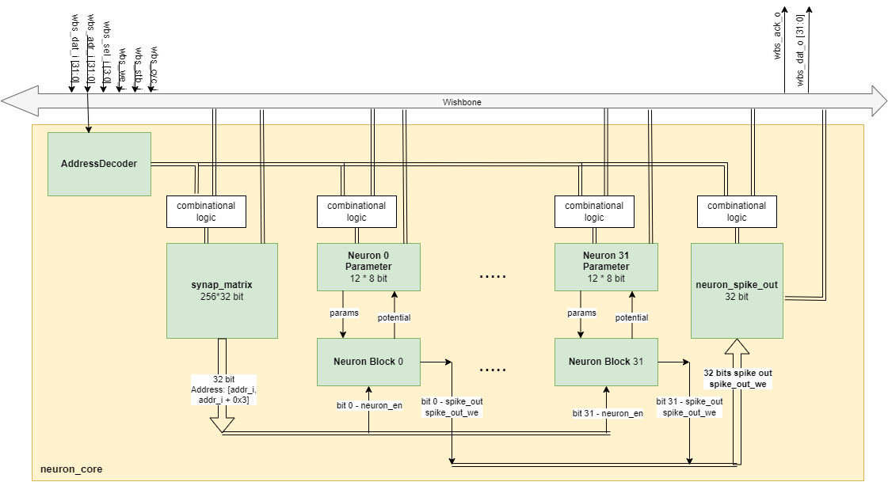

# edabk_brain_soc

 

A project dedicated to developing a hardware-software co-design for neurosynaptic core based on Spike Neural Network (SNN) architecture, integrated with RISC-V based SoC, powered by the RTL code generated by ChatGPT-4 with advanced optimizations.

## Background of SNN network

Spike Neural Networks (SNNs) are inspired by the way biological neurons transmit information through discrete spike signals. Unlike conventional artificial neural networks, where neurons output scalar values through activation functions, SNNs operate using spike-based communication. This attribute brings several advantages:

1. **Energy Efficiency**: SNNs typically consume less power, making them suitable for battery-operated devices and edge computing.

2. **Real-time Processing**: The discrete spike-based communication can lead to faster response times, especially advantageous for real-time applications.

3. **Biomimetic Computation**: The spike-based nature of SNNs makes them potentially more capable of mimicking biological neural processes.

Incorporating SNNs into a System on Chip (SoC) design can further enhance these advantages. The integration becomes even more promising when based on the RISC-V architecture, an open-source instruction set architecture (ISA) that has seen rapid adoption due to its flexibility, scalability, and modular nature.

**RISC-V and SNNs**: Integrating SNNs into a RISC-V based SoC allows for the leveraging of the RISC-V ecosystem, including its tools, software, and community support. This can expedite development and allow for more seamless integration of the neural network components with other system functionalities. Moreover, the modular nature of RISC-V makes it easier to add custom instructions or extensions, enabling hardware-level optimizations for SNNs.

---
## Architecture Design

- We take references from the SNN network proposed in the following paper: 
    + IBM TrueNorth neurosynaptic chip design: https://ieeexplore.ieee.org/document/7229264
    + RANC network: https://arxiv.org/abs/2011.00624
- Instead of creating multiple cores (each core having 256 neurons and 256 axons), we came up with the idea to design and implement a hardware-software co-design for SNNs:
  - There is only one physical core, but it can act as multiple cores thanks to software control (C code).
  - This is feasible because the cores have identical structures, differing only in their parameter sets (such as synapse_matrix parameters, neuron parameters). Therefore, we can build just one physical core and use software to switch cores (when needed) by saving the parameters of the old core after computation and loading the parameter set of the new core. 
  - The software will help determine which core the outgoing packets will go to, identify which core is currently in use, and manage the scheduler for packets to the core, as well as the core switching process. 
- For simplicity, we design our chip only consists of 1 physical neuron core with 256 axons and 32 neurons (256x32) 
 
We completed the block diagram of the design before implementing the design using ChatGPT.

### Block diagram of the SNN Neuron Core Module

### Components

- **`AddressDecoder`**: The `AddressDecoder` module is instantiated as `addr_decoder` and it is responsible for decoding the incoming address `(wbs_adr_i)` to determine which part of the neuron core should be accessed. It outputs signals that indicate whether the access is for the synapse matrix, neuron parameters, or neuron spike output.

- **`synap_matrix`**: The `synap_matrix` submodule interacts with the Wishbone bus and receives configuration data, such as connections between axons and neurons. This module outputs the connections of incoming axon with 32 neurons in `neurons_connections`, which are fed into each neuron_parameters instance.

- **`neuron_spike_out`**: The `neuron_spike_out` submodule captures the spikes generated by all the neuron blocks. It receives an enable signal from the `external_write_en`, which is an OR-ed version of all individual spikes (`|spike_out`), indicating if any neuron has spiked.

- **Neuron Instances**: 
  + A generate block creates 32 instances of neurons (neuron_instances), each comprising `neuron_parameters` and a `neuron_block`.
  + **`neuron_parameters`**: It holds the parameters like voltage potential, thresholds, leak values, and reset values for each neuron (which will be used in neuron_block to calculate new potential). These are configured via the Wishbone interface. Additionally, it takes in the new potential (new_potential) from its corresponding neuron_block.
  + **`neuron_block`**: It calculates the new potential for a neuron based on the current potential, inputs, and parameters provided by neuron_parameters. It also determines if a neuron spikes and sends this spike out (`spike_out[i]`).

---

## User Project Interface Ports

| Signal     | Connection                 | Type   |
|------------|----------------------------|--------|
| wb_clk_i   | clk                        | Input  |
| wb_rst_i   | rst                        | Input  |
| wbs_stb_i  | wbs_stb_i                  | Input  |
| wbs_cyc_i  | wbs_cyc_i                  | Input  |
| wbs_we_i   | wbs_we_i                   | Input  |
| wbs_sel_i  | wbs_sel_i[3:0]             | Input  |
| wbs_dat_i  | wbs_dat_i[31:0]            | Input  |
| wbs_adr_i  | wbs_adr_i[31:0]            | Input  |
| wbs_ack_o  | wbs_ack_o                  | Output |
| wbs_dat_o  | wbs_dat_o[31:0]            | Output |
| la_data_in | la_data_in[127:0]          | Input  |
| la_data_out| la_data_out[127:0]         | Output |
| io_in      | io_in[`MPRJ_IO_PADS-1:0]   | Input  |
| io_out     | io_out[`MPRJ_IO_PADS-1:0]  | Output |
| user_irq   | user_irq[2:0]              | Output |
| vccd1      | vccd1                      | Power  |
| vssd1      | vssd1                      | Ground |

---

## User Project Memory Mapping

| Address (Bytes)        | Function               |
|------------------------|------------------------|
| 0x30000000 - 0x30003FFF| synap_matrix           |
| 0x30004000 - 0x3000400B| param0                 |
| 0x30004010 - 0x3000401B| param1                 |
| 0x30004020 - 0x3000402B| param2                 |
| ...                    | ...                    |
| 0x300040F0 - 0x300040FB| param31                |
| 0x30008000 - 0x30008003| neuron_spike_out       |

---
## ChatGPT 4.0 flow to generate the HDL design

- **Firstly**, we describe to ChatGPT in details, the functional specification and interface ports of each submodules (memory module will have to follow by Wishbone interface). After ChatGPT generate the HDL code for the submodule, we will ask for review of this code by creating another chat sessions then give feedback for the code, e.g. missing functionalities, incorrect protocols, need for comment,... such that ChatGPT will give us the code that satisfies the design specifications. 
- **Secondly**, we ask ChatGPT to automatically create RTL testbench for each submodule based its own generated RTL code of that submodule. And then we use that testbench to test the submodule (via Questasim), and give feedback to the ChatGPT to modify the sudmodule code accordingly.
- **Finally**, we ask ChatGPT to integrate all of the submodules into the module `neuron_core`, and add that into `user_project_wrapper`

### Notes on ChatGPT code generation
- During our code generation flow, we find that the best approach to guide ChatGPT to generate the satisfied code, is that we need to provide detailed interface ports description, as well as the functionalities of our modules.
- Knowing how to give feedback to ChatGPT is also important: We should point out the specific parts in our code that need modifications. 

---
## Testing and validation

The diagram above describes the testing environment that the team implemented. To perform testing, the test suite retrieves parameters about the network and neurons, as well as the golden outputs (expected output) that have been calculated in the C code. Then, the test suite communicates with the neuron_core through the wishbone bus standard to deliver inputs, read outputs from the neuron_core, and proceed to compare them with the golden outputs received from the software code.

---
## Contributor
The project is contributed by EDABK Lab, School of Electronics and Electrical Engineering, HUST

# Forked from the Caravel User Project

| :exclamation: Important Note            |
|-----------------------------------------|

## Caravel information follows

Refer to [README](docs/source/index.rst#section-quickstart) for a quickstart of how to use caravel_user_project

Refer to [README](docs/source/index.rst) for this sample project documentation. 

Refer to the following [readthedocs](https://caravel-sim-infrastructure.readthedocs.io/en/latest/index.html) for how to add cocotb tests to your project. 
